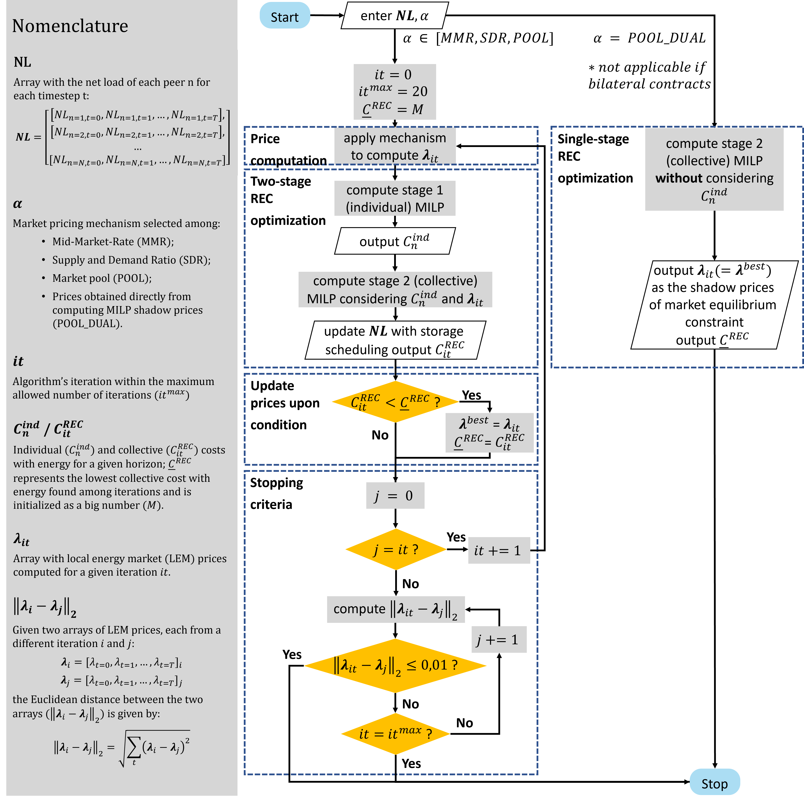
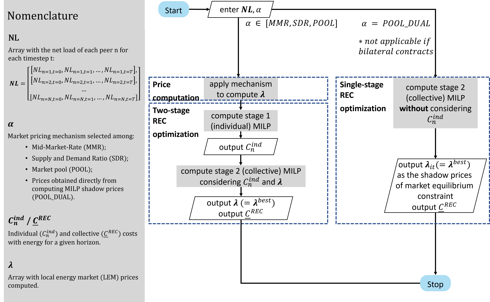
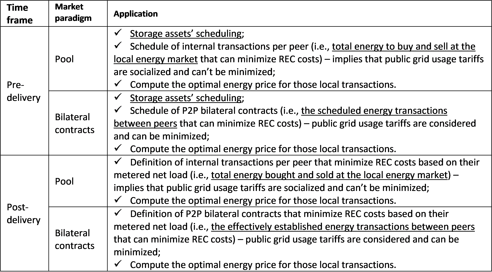

```
   _____   ______  _____    ____                            _    _                 _____   ______   _____  _______             _____  _____ 
 |  __ \ |  ____|/ ____|  / __ \                          | |  (_)               |  __ \ |  ____| / ____||__   __|     /\    |  __ \|_   _|
 | |__) || |__  | |      | |  | | _ __    ___  _ __  __ _ | |_  _   ___   _ __   | |__) || |__   | (___     | |       /  \   | |__) | | |  
 |  _  / |  __| | |      | |  | || '_ \  / _ \| '__|/ _` || __|| | / _ \ | '_ \  |  _  / |  __|   \___ \    | |      / /\ \  |  ___/  | |  
 | | \ \ | |____| |____  | |__| || |_) ||  __/| |  | (_| || |_ | || (_) || | | | | | \ \ | |____  ____) |   | |     / ____ \ | |     _| |_ 
 |_|  \_\|______|\_____|  \____/ | .__/  \___||_|   \__,_| \__||_| \___/ |_| |_| |_|  \_\|______||_____/    |_|    /_/    \_\|_|    |_____|
                                 | |                                                                                                       
                                 |_|
```

# Documentation

The *Community Market Pool* use case aims to provide **optimal local energy market (LEM) prices** for Renewable Energy
Communities (REC) under the *Enershare* project. To this end, various mechanisms and algorithms are provided for
calculating these prices. The optimality of the price arrays computed depends on the architecture of the REC, 
the assets of its members and their energy supply contracts with their suppliers, but it is always measured 
by its ability to promote internal transactions as opposed to buying or selling energy from traders.

To that end, a library was implemented, named ***rec_op_lem_prices*** 
(**R**enewable **E**nergy **C**ommunities **Op**eration and **L**ocal **E**nergy **M**arket **Pricing**), 
that provides the user with two sets of functions:
- ***optimization_functions***, which include calls to a MILP module for individual and collective optimal management of 
REC with stationary storage, PV generation and inflexible loads (all assets are assumed to be *behind-the-meter*)


- ***pricing_mechanisms_functions***, which include several algorithms for defining LEM prices for a particular 
operation horizon, taking advantage of the optimization functions also provided

Both sets of functions are based on a basic MILP formulation for the scheduling of controllable assets 
(namely batteries) and/or the optimal internal exchanges that should be established within a REC (a thorough explanation 
of the algorithms implemented is published [here](https://www.mdpi.com/1996-1073/16/3/1143)). From there, the user is 
presented with a variety of possibilites, namely:
- make an individual optimization of the assets of any member of the REC,
- make a collective optimization of the assets of all members of the REC,
- make the same collective optimization but guaranteeing that the cost of each member is not penalized by participating 
in the REC

LEM prices can be computed through several pricing mechanisms and may require the computation of collective optimization 
MILP. It is also important to define the timeframe for which the prices are being computed, since they can be used to 
promote a REC operation centered on maximizing internal transactions or to establish the most advantageous transactions 
for all members before communicating the share coefficients to the DSO.

The overarching algorithm implemented for price computation, for the pre-delivery timeframe, is pictured below:



whilst the overarching algorithm implemented for the post-delivery timeframe is pictured below:



Besides choosing between timeframes, the user will also be able to define the market paradigm for transacting local 
energy:

- either a true pool, where for each member only the total transacted energy (bought and sold) are established;
- or bilateral contracts, where P2P transactions are specified.

The following table explains the application scope of each combination between timeframe and market paradigm:




Finally, the several market pricing mechanisms that can be chosen are:

- **Mid-market rate (MMR)**
- **Supply and demand ratio (SDR)**
- **Compensated supply and demand ratio (SDRC)**
- **Pool equilibrium**

The first three mechanisms, MMR, SDR and SDRC are made available in two forms. A "complete" form, where all potential 
buying and selling offers are considered for computing the prices at each time step, and a "partial" form where the only 
offers considered are the ones that would be accepted if they were made under a pool equilibrium mechanism.
More information on the equations behind these pricing mechanisms can be found 
[here](https://www.mdpi.com/1996-1073/16/4/1949).


Notes:
- The pre-delivery timeframe algorithm is highly dependent on the quality and granularity of generation and consumption 
forecast data.
- All logic used for estimating costs follows the Portuguese legislation for REC in vigor (2023).
- Stationary batteries are modelled following a simple "bucket" model which is 
technology-agnostic.

## Main optimization functions overview
Under ```rec_management_tools.optimization_functions``` the user can find:


```run_pre_individual_milp``` 
- run a pre-delivery individual MILP, for a single REC member

```run_pre_single_stage_collective_pool_milp``` 
- run a purely collective pre-delivery MILP, considering a *pool* LEM structure  

```run_pre_single_stage_collective_bilateral_milp``` 
- run a purely collective pre-delivery MILP, considering a *bilateral* LEM structure  

```run_pre_two_stage_collective_pool_milp``` 
- run the two-stage collective pre-delivery MILP, where individual MILP are computed for each member and the resulting 
operation costs with energy are fed into the collective MILP stage as constraints, considering a *pool* LEM structure

```run_pre_two_stage_collective_bilateral_milp``` 
- run the two-stage collective pre-delivery MILP, considering a *bilateral* LEM structure

```run_post_individual_cost``` 
- run a post-delivery individual MILP, for a single REC member

```run_post_single_stage_collective_pool_milp``` 
- run a purely collective post-delivery MILP, considering a *pool* LEM structure 

```run_post_single_stage_collective_bilateral_milp``` 
- run a purely collective post-delivery MILP, considering a *bilateral* LEM structure  

```run_post_two_stage_collective_pool_milp``` 
- run the two-stage collective post-delivery MILP, considering a *pool* LEM structure

```run_post_two_stage_collective_bilateral_milp``` 
- run the two-stage collective pre-delivery MILP, considering a *bilateral* LEM structure


### Main pricing mechanisms functions overview
Under ```rec_management_tools.pricing_mechanisms_functions``` the user can find:

```vanilla_mmr```
- compute a LEM prices' array based on the MMR mechanism; no MILP is solved, the LEM offers are constructed based only 
on the members' forecasted/ historical net consumption and respective opportunity costs; a pruned version (default) 
can be selected where a preliminary pool is cleared and only accepted offers are considered   

```vanilla_sdr```
- compute a LEM prices' array based on the SDR mechanism; again, in this *vanilla* version, no MILP is solved, and a 
pruned version is also available; it is also possible to establish a compensation factor between 0 and 1 to consider an 
SDRC mechanism

```vanilla_crossing_value```
- compute a LEM prices' array based on a market pool clearing; again, in this *vanilla* version, no MILP is solved

```dual_pre_pool```
- a purely collective pre-delivery MILP is run and the shadow prices of a LEM equilibrium constraint are returned as 
the optimal LEM prices  

```dual_post_pool```
- a purely collective post-delivery MILP is run and the shadow prices of a LEM equilibrium constraint are returned as 
the optimal LEM prices

```loop_pre_pool_mmr```
- the overarching iterative algorithm presented above for the pre-delivery timeframe and a *pool* market structure is 
run considering MMR as the pricing mechanism; a pruned version is also made available

```loop_pre_pool_sdr```
- the overarching iterative algorithm presented above for the pre-delivery timeframe and a *pool* market structure is 
run considering SDR as the pricing mechanism; pruned a compensated versions are also made available 

```loop_pre_pool_crossing_value```
- the overarching iterative algorithm presented above for the pre-delivery timeframe and a *pool* market structure is 
run considering the pool clearing as the pricing mechanism

```loop_pre_bilateral_mmr```
- the overarching iterative algorithm presented above for the pre-delivery timeframe and a *bilateral* market structure 
is run considering MMR as the pricing mechanism; a pruned version is also made available

```loop_pre_bilateral_sdr```
- the overarching iterative algorithm presented above for the pre-delivery timeframe and a *bilateral* market structure 
is run considering SDR as the pricing mechanism; pruned a compensated versions are also made available 

```loop_pre_bilateral_crossing_value```
- the overarching iterative algorithm presented above for the pre-delivery timeframe and a *bilateral* market structure 
is run considering the pool clearing as the pricing mechanism

```loop_post_pool_mmr```
- the overarching iterative algorithm presented above for the post-delivery timeframe and a *pool* market structure is 
run considering MMR as the pricing mechanism; a pruned version is also made available

```loop_post_pool_sdr```
- the overarching iterative algorithm presented above for the post-delivery timeframe and a *pool* market structure is 
run considering SDR as the pricing mechanism; pruned a compensated versions are also made available 

```loop_post_pool_crossing_value```
- the overarching iterative algorithm presented above for the post-delivery timeframe and a *pool* market structure is 
run considering the pool clearing as the pricing mechanism

```loop_post_bilateral_mmr```
- the overarching iterative algorithm presented above for the post-delivery timeframe and a *bilateral* market structure 
is run considering MMR as the pricing mechanism; a pruned version is also made available

```loop_post_bilateral_sdr```
- the overarching iterative algorithm presented above for the post-delivery timeframe and a *bilateral* market structure 
is run considering SDR as the pricing mechanism; pruned a compensated versions are also made available 
```loop_post_bilateral_crossing_value```
- the overarching iterative algorithm presented above for the post-delivery timeframe and a *bilateral* market structure 
is run considering the pool clearing as the pricing mechanism


## Install guide: use it as a library

The tool is implemented as a Python library. To install the library in, for example, a virtual environment, one must:
- download this repository
- change the working directory to the root folder of the repository:
    ```shell
    % cd /path/to/root_folder
    ```
- create the wheel file that will allow you to install the repository as a Python library 
(make sure you have previously installed Python ~= 3.10 in your local computer / server);

    ```shell
    % python setup.py bdist_wheel
    ``` 
- after creating your virtual environment and activating it
    (see [this](https://conda.io/projects/conda/en/latest/user-guide/tasks/manage-environments.html#activating-an-environment)
    example for conda environments), enter the newly created ```dist``` folder, copy the name of the ```.whl``` file and 
install the library by using:
    ```shell
    % pip install wheel_file_name.whl
    ```
- (optional) return to the root folder path and run the tests provided to assert everything is working as it should:
    ```shell
    % python setup.py pytest
    ```
- to import the library use:
    ```shell
    import rec_op_lem_prices as rolp
    ```
  All methods listed above will be straightly available.  